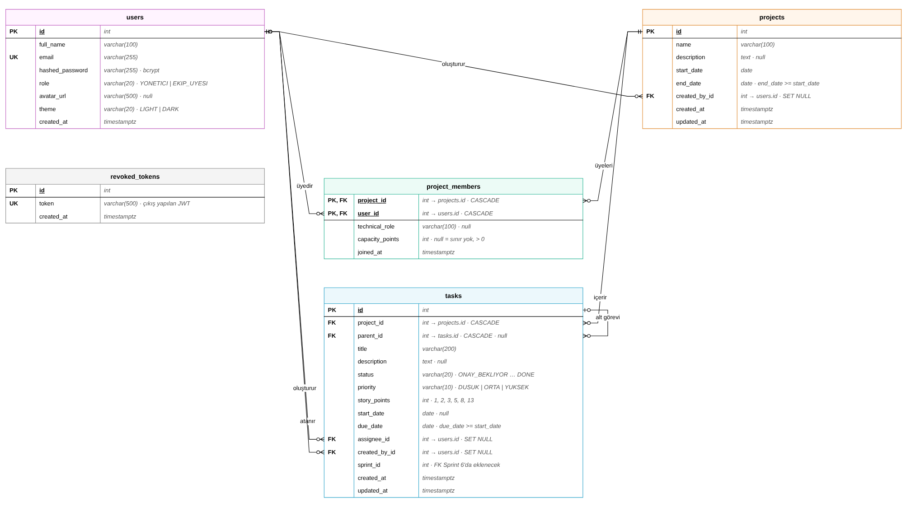

# LUNO · ER Diyagramı (Sprint 2)

Sprint 2–4'te kullanılacak temel tablolar: `users`, `revoked_tokens`, `projects`, `project_members`, `tasks`.
Kaynak: API Sözleşmesi v1.1, bölüm 2 (Veri nesneleri). Model kodu: `backend/app/models/`.

Düzenlenebilir kaynak: [`er-diyagrami.drawio`](er-diyagrami.drawio) (draw.io / diagrams.net ile açılır). Değişiklik yapınca PNG'yi *File → Export as → PNG* ile yeniden dışa aktarın.

## Tablolar

| Tablo | Model | Açıklama |
|---|---|---|
| `users` | `app/models/user.py` (Esra, US-001 – US-004) | Kullanıcılar ve sistem rolleri |
| `revoked_tokens` | `app/models/user.py` (Esra, US-003) | Çıkış yapılmış JWT'ler |
| `projects` | `app/models/project.py` | Projeler |
| `project_members` | `app/models/project_member.py` | Proje üyelikleri, teknik rol ve kapasite |
| `tasks` | `app/models/task.py` | Görevler ve alt görevler |

## Kurallar

| Kural | Nerede | Kaynak |
|---|---|---|
| E-posta benzersiz | `users.email` unique index | FR-003 |
| Yeni kullanıcı `EKIP_UYESI` | `users.role` varsayılan değer | FR-010 |
| Şifreler düz metin değil, bcrypt hash olarak saklanır | `users.hashed_password` | NFR-001 |
| Bir kişi bir projeye bir kez üye olur | `project_members` birleşik PK | — |
| Proje bitişi başlangıçtan önce olamaz | `projects` check kısıtı | FR-016 |
| Teslim tarihi başlangıçtan önce olamaz | `tasks` check kısıtı | FR-025 |
| Görev durumu ve önceliği yalnızca tanımlı değerler | `tasks` check kısıtları | Sözleşme 1.3 |
| Efor puanı 1, 2, 3, 5, 8, 13 | `tasks` check kısıtı | FR-036 |
| Kapasite boşsa sınır yok, doluysa > 0 | `project_members` check kısıtı | FR-074, FR-075 |
| Proje silinince görevleri ve üyelikleri silinir | `ON DELETE CASCADE` + ORM cascade | FR-020 |
| Ana görev silinince alt görevleri silinir | `tasks.parent_id ON DELETE CASCADE` + ORM cascade | Sözleşme 6.7 |
| Atanan kişi silinince görev atamasız kalır | `tasks.assignee_id ON DELETE SET NULL` | Sözleşme 5.10 |
| Şema değişiklikleri yalnızca Alembic migration ile yapılır | `backend/alembic/versions/` | NFR-018 |
| 200 görev / 20 üyeli projeyle test edilebilir | `python -m app.seed --buyuk` | NFR-011 |

Durum ve öncelik, `users.role` ile aynı şekilde metin (`varchar`) olarak saklanır ve CHECK kısıtıyla korunur. Böylece SQLite (testler, varsayılan `.env`) ve PostgreSQL'de aynı şekilde çalışır; ileride yeni değer eklemek de tek bir migration ile yapılır.

## Tabloda tutulmayan, API'de hesaplanan alanlar

- `Project.progress_percent` (FR-061), `Project.member_count`
- `Task.risk_level` (FR-070 – FR-072), `subtask_count`, `subtask_done_count`, `comment_count`, `file_count`
- `ProjectMember.email`, `ProjectMember.system_role` (`users` tablosundan gelir)

## API katmanında kontrol edilecek kurallar

- Alt görevin alt görevi olamaz (6.10, `NESTED_SUBTASK_NOT_ALLOWED`).
- Atanan kişi projenin üyesi olmalı (6.2, `ASSIGNEE_NOT_MEMBER`).
- Üye projeden çıkarılınca o projedeki görevlerinin `assignee_id`'si `null` yapılır (5.10).

## Sonraki sprintlerde eklenecek tablolar

| Tablo | Sprint | Not |
|---|---|---|
| `project_invites` | 3 | Davet bağlantıları (FR-021) |
| `labels`, `task_labels` | 4 | Etiketler (FR-037) |
| `files`, `comments` | 5 | Dosya ve yorumlar (FR-046 – FR-050) |
| `notifications` | 6 | Bildirimler (FR-051) |
| `sprints` | 6 | `tasks.sprint_id` için FK bu tabloyla eklenir |
| `notification_preferences`, `password_reset_tokens` | 8 | Bildirim tercihleri, şifre sıfırlama |
| `task_dependencies` | 9 | Görev bağımlılıkları (FR-040) |
